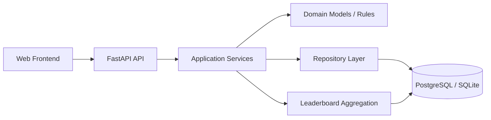
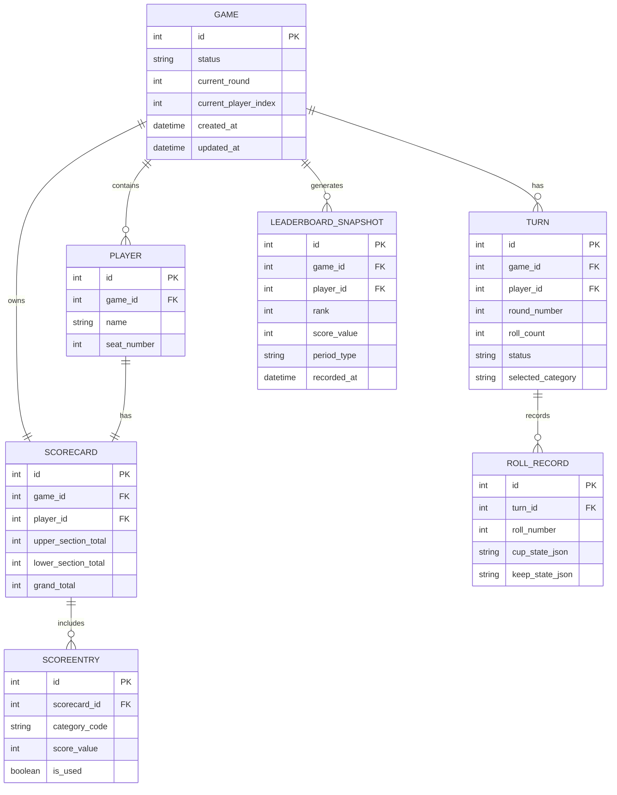

# Architecture

## Purpose
This document defines the recommended architecture for the Yahtzee web application described in the updated PRD. The target is a secure, responsive, and reliable game experience that persists active game state and historical leaderboards.

## Goals
- Support web-based gameplay for up to 4 players.
- Persist current game state including players, rounds, turns, scorecards, dice state, and cup/keep selections.
- Maintain leaderboard history for current-game, weekly, and all-time rankings.
- Keep the initial implementation simple enough to ship quickly while remaining extensible.

## Non-goals for v1
- Multi-room multiplayer across separate devices without a shared session.
- User accounts or authentication beyond basic access control if needed.
- Distributed microservices or event-driven architecture beyond what is necessary for a single deployment.

## Architectural style
A modular monolith is recommended for the first release.

Why this is the right fit:
- The product is stateful and turn-based.
- The domain is cohesive and relatively small.
- It is easier to build, test, and deploy than a distributed system.
- It allows the team to evolve into a more service-oriented design later if needed.

## Target runtime components

## Components

### 1. Frontend
Responsible for:
- Game creation and player registration
- Dice rolling and keeper selection
- Scorecard entry and turn flow
- Current-game and historical leaderboard display

Recommended stack:
- A lightweight web UI for v1, with the option to evolve into React later
- Responsive CSS or a simple component library
- State management for game session data

### 2. API layer
Responsible for:
- Accepting client actions
- Validating requests
- Coordinating game state updates
- Returning current game state and leaderboard data

Suggested interfaces:
- REST endpoints for game lifecycle actions
- Optional WebSocket or SSE for live updates later

### 3. Application services

#### Game service
Handles:
- game creation
- player registration
- starting or aborting a game
- advancing rounds and turns

#### Scoring service
Handles:
- scoring rules for upper and lower sections
- validation of category usage
- total calculation

#### Leaderboard service
Handles:
- current game rankings
- weekly rankings
- all-time rankings
- periodic snapshot generation

#### Repository layer
Handles:
- persistence of active games and historical snapshots
- transactional updates for score submission and turn progression
- read models for gameplay and leaderboard views

## Domain model
The core domain objects are:
- Game
- Player
- ScoreCard
- ScoreEntry
- Turn
- RollRecord
- LeaderboardSnapshot

The PRD’s cup and keep concepts should be represented as part of turn state:
- cup state: the latest dice values from the current roll
- keep state: which dice are held for subsequent rolls

### Entity relationship diagram

## Recommended implementation changes
1. Replace the current in-memory game store with a repository-backed persistence layer.
2. Introduce ORM models and migrations for the relational schema.
3. Make score submission and turn progression transactional.
4. Add explicit leaderboard snapshot generation for weekly and all-time views.
5. Keep the frontend thin and let the backend remain the source of truth.

## Suggested code structure
- app/domain/: domain models and enums
- app/services/: game, scoring, and leaderboard orchestration
- app/repositories/: persistence abstractions
- app/api/: routers, schemas, and error handling
- app/db/: ORM models and migrations
- tests/: domain, service, and API behavior

## State management approach
The backend should remain the source of truth for all game rules. The frontend should not independently decide whether a turn or score is valid.

Game state should be persisted after each meaningful action, including:
- player registration
- turn progression
- roll updates
- score submission
- game completion or abort

## Security and reliability
The system should enforce:
- HTTPS for all client-server traffic
- Server-side validation of all score and turn actions
- Protection against invalid or out-of-sequence moves
- Audit logging of game changes
- Safe concurrent update handling for shared game sessions

## Deployment model
For v1:
- A single deployable backend application
- A single relational database
- Optional Redis later for session caching or realtime support if needed

Recommended deployment:
- Docker for local development
- Container-based hosting in a cloud platform for production

## Architectural decisions summary
- Use a modular monolith rather than microservices.
- Keep the backend authoritative for game state.
- Persist game state in a relational database.
- Use a responsive web frontend.
- Introduce realtime updates only after the core gameplay loop and persistence layer are stable.
