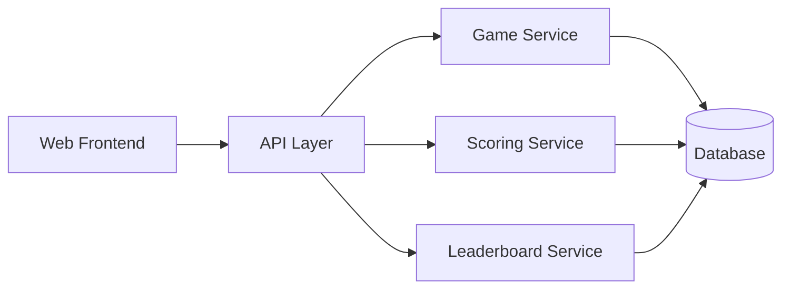

# Architecture

## Purpose
This document defines the target system architecture for the Yahtzee web application described in PRD.md. It is intended to guide implementation, future maintenance, and agent-assisted development.

## Goals
- Deliver a responsive web-based Yahtzee experience for up to 4 players.
- Persist game state server-side so turns, rounds, scorecards, and leaderboards are reliable.
- Keep the initial architecture simple enough to implement quickly while remaining extensible.

## Non-goals for v1
- Multiplayer rooms across different devices without a shared game session.
- User accounts and authentication beyond basic access control if needed.
- Distributed microservices or event-driven architecture beyond what is necessary for a single deployment.

## Architectural style
A modular monolith is recommended for the first release.

Why this is the right fit:
- The product is stateful and turn-based.
- The domain is cohesive and relatively small.
- It is easier to build, test, and deploy than a distributed system.
- It allows the team to evolve into a more service-oriented design later if needed.

## High-level structure

## Components

### 1. Frontend
Responsible for:
- Game setup and player registration
- Dice rolling and keeper selection
- Scorecard entry and turn flow
- Leaderboard display

Recommended stack:
- React
- TypeScript
- Responsive CSS or component library
- State management for game session data

### 2. API layer
Responsible for:
- Accepting client actions
- Validating requests
- Coordinating game state updates
- Returning current game state and leaderboards

Suggested interfaces:
- REST endpoints for game lifecycle actions
- WebSocket or SSE for live updates

### 3. Domain services

#### Game service
Handles:
- game creation
- player registration
- starting or aborting a game
- advancing rounds and turns

#### Turn service
Handles:
- rolling dice
- managing keepers
- enforcing turn limits
- completing a turn after scoring

#### Scoring service
Handles:
- scoring rules for upper and lower sections
- validation of category usage
- total calculation

#### Leaderboard service
Handles:
- current game rankings
- weekly rankings
- all-time rankings

## Domain model
The core domain objects are:
- Game
- Player
- ScoreCard
- ScoreEntry
- Turn
- RollState
- LeaderboardSnapshot

## State management approach
The backend is the source of truth for all game rules. The frontend should not independently decide whether a turn or score is valid.

Game state should be persisted after each meaningful action, including:
- player registration
- turn progression
- roll updates
- score submission
- game completion or abort

## Security and reliability
The system should enforce:
- HTTPS for all client-server traffic
- Server-side validation of all score and turn actions
- Protection against invalid or out-of-sequence moves
- Audit logging of game changes
- Safe concurrent update handling for shared game sessions

## Deployment model
For v1:
- Single deployable backend application
- Single relational database
- Optional Redis later for session caching or realtime support if needed

Recommended deployment:
- Docker for local development
- Container-based hosting in a cloud platform for production

## Architectural decisions summary
- Use a modular monolith rather than microservices.
- Keep the backend authoritative for game state.
- Persist game state in a relational database.
- Use a responsive web frontend.
- Introduce realtime updates only after the core gameplay loop is stable.
